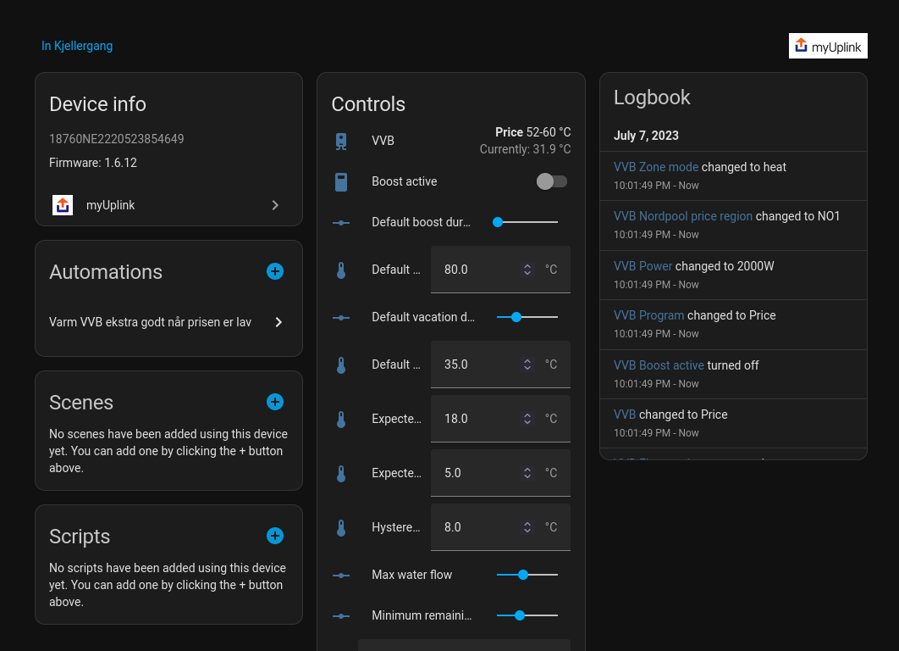

# MyUplink integration for Home Assistant

Custom Home Assistant integration for devices and sensors in [myUplink](https://myuplink.com/) account.

This integration should work with most smart devices from brands listed [here](https://myuplink.com/legal/works-with/en).

## Install
### HACS
The easiest way to install this component is by clicking the badge below, which adds this repo as a custom repo in your HASS instance.

You can also add the integration manually by copying `custom_components/myuplink` into `<HASS config directory>/custom_components`
### Configuration

To use this integration, you need to make an application at [dev.myuplink.com](https://dev.myuplink.com/). 

Remember to set a valid Callback Url. Make sure you use `https://my.home-assistant.io/redirect/oauth`, as HA currently uses that callback URL by default for the Oauth2 config flow.

_Note: You cannot edit the Callback Url after the application has been created, even though the GUI makes you think so. Create a new one if you want to change it._

Start the myUplink integration setup and copy the Client Identifier and Client Secret from your myUplink-application into the OAuth text fields.

Next, approve access via the OAuth pop-up and you should be good to go!

## Troubleshooting

Reading this might help if you run into issues

### "Sorry, there was an error : invalid_request"

This often means that the Callback URL provided is invalid or unreachable.

Double-check that the Callback URL saved in the myUpLink application is correct.

### "Sorry, there was an error : unauthorized_client"

This means that the credentials used by the integration is invalid. This often occurs when the myuplink-application is deleted and recreated, without deleting the old credentials from Home Assistant.

You can delete the old credentials stored in Home Assistant by going to the Devices & Services page, clicking the three dots top right and selecting "Application Credentials". Delete the one originating from myuplink, and you'll be prompted for new credentials next time you set up the integration.

### Some entities don't look right

This can happen when the device is integrated poorly with the myUpLink-API, or it's implemented in a way this integration cannot handle yet.

See the debugging section below to find some useful info about the offending data point.

## Debugging misbehaving entities

If the your entities are malformed, it's often caused by the manufacturer's implementation of the myUpLink-API. The easiest way to check this is by getting the raw data points from the Swagger client.

1. Take note of the entity's name, and open [myUpLink's Swagger](https://api.myuplink.com/swagger/index.html).
2. Click Authorize and paste your application credentials. Make sure to check the READSYSTEM box.
3. Find your device ID by querying ​`/v2​/systems​/me`, and enter it when querying `/v2/devices/{deviceId}/points`.
4. Find the relevant data points and post them in an issue.