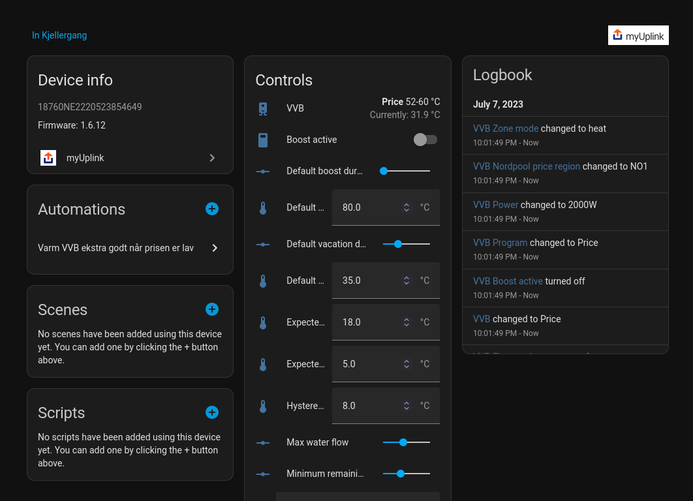

# myUplink integration for Home Assistant

This custom integration reads and controls devices exposed by your [myUplink](https://myuplink.com/) account. It uses myUplink's cloud API and OAuth authorization. Available entities depend on the device manufacturer's API data.

## Installation and account setup

The 1.9.x series supports Home Assistant **2026.1 and newer**. Home Assistant provides the required Python runtime. See the [1.9.0 upgrade notes](CHANGELOG.md) for changes when updating from 1.8.x.

Install through HACS using this custom repository:

Alternatively, copy the **custom_components/myuplink** directory into your Home Assistant configuration's **custom_components** directory. Restart Home Assistant after installation.

1. Register an application at [dev.myuplink.com](https://dev.myuplink.com/).
2. Set its callback URL to **https://my.home-assistant.io/redirect/oauth**.
3. In **Settings → Devices & services**, select **Add integration → myUplink**.
4. Enter the application's **Client Identifier** and **Client Secret** when prompted. These identify your application; they are separate from your myUplink account login.
5. Sign in to myUplink and authorize the application's requested access: **READSYSTEM**, **WRITESYSTEM**, and **offline_access**.
6. Save the integration options.

An internet connection and an account containing a device exposed by the API are required. Account access and subscriptions determine whether the API accepts writes. The client uses Home Assistant's HTTP session; no separate myUplink client package is installed.

## Supported devices and functions

General support follows the devices reported by your account's API. See the provider's [supported brands](https://myuplink.com/legal/works-with/en); individual model capabilities vary.

| Function | Availability |
| --- | --- |
| Parameter sensors | Read-only numeric values and enumerated states reported by the device |
| Binary sensors and switches | Boolean points, with switches created for writable points |
| Number and select controls | Writable bounded or enumerated points, plus numeric temperature points without bounds |
| Connection state | A diagnostic binary sensor that stays usable while the device is disconnected |
| Notifications | A diagnostic count and notification attributes; disabled by default for newly created entities |
| Firmware information | An update entity reporting installed and available versions; installation is performed through the provider |
| Smart home mode | System modes such as Home, Away, and Vacation; enable in options |
| Smart home zones | Climate controls and optional temperature, humidity, and CO2 sensors; enable in options |
| Water heater | Products whose API name starts with **18760NE**, with points **406, 500, 516, 527, and 528** present |
| Raw actions | Administrator actions for a parameter ID or a zone property |

Smart home mode attaches to the device for a single-device system and to a system registry device for a multi-device system. Zone names come from your account. Parameter names and enum text come from the API's language response; fixed labels are translated in English, German, Danish, and Norwegian Bokmål.

Writable, finite numeric temperature points in °C or °F are exposed as number controls when both API bounds are absent, including the iGate 2.0 heat/cool setpoints. These controls use Home Assistant's default range of **0–100 in the native temperature unit**, not manufacturer-specified limits. The API's step and scale metadata are still used, and requested temperatures are sent without applying the scale twice.

Reload after upgrading to discover these number controls. An existing sensor for the same point may remain unavailable; update any automations that reference it to use the new number entity. Points keep their initial platform until reload, including points first discovered with an unavailable reading.

## Options

Open the integration entry's **Configure** menu to change options. Saving changed options reloads the entry.

| Option | Default | Effect |
| --- | --- | --- |
| Enable smart home mode | On | Fetch the system mode and create its select control |
| Enable smart home zones | On | Fetch zone readings and supported thermostat controls |
| Fetch firmware information | On | Fetch installed and available firmware versions |
| Fetch notifications | On | Fetch active notifications; enable the notification entity manually if wanted |
| Scan interval | 300 seconds | Poll every 5–600 seconds, in 5-second increments |
| Keep disconnected device readings available | Off | Keep cached device readings available when the device disconnects; cloud update failures still make entities unavailable |
| Expert mode | Off | Show the advanced fields below |

Expert fields use JSON. An empty field preserves the existing setting; invalid JSON or an unsupported structure restores the client's default. Parameter lists accept integers or integer text, platform overrides accept the five parameter platforms, and writable overrides require JSON booleans.

| Expert option | Default | Example and purpose |
| --- | --- | --- |
| Platform overrides | Built-in point corrections | **{"12345": "sensor"}** forces a point to a supported parameter platform |
| Writable without subscription | On | Creates writable controls from API metadata even when a Manage subscription is not reported; the API still decides whether writes are permitted |
| Writable overrides | Built-in point corrections | **{"12345": false}** treats a point as read-only |
| Parameter whitelist | Empty | **[12345, 12346]** limits requested point IDs; an empty list requests all points |
| Additional parameters | Empty | **[12347]** requests known point IDs omitted from the normal response |

Water-heater controls require all five listed points. A whitelist that omits them prevents this entity from being created. Platform and writable overrides help with incorrect manufacturer metadata and do not grant permissions.

## Data updates and availability

The default cloud polling interval is five minutes. Each refresh reads the account's systems, each device's points, and enabled mode, zone, and notification endpoints. Subscription permissions are cached for 15 minutes and firmware metadata for one hour. These caches are cleared when the account reloads; failed lookups are retried without caching the failure. Without a whitelist, additional parameter IDs require another point request per device.

The API's quota headers determine backoff. The client paces requests near the reported limit and defers an exhausted window. HTTP 429 responses use **Retry-After** seconds or an HTTP date, then **RateLimit-Reset**, then a 60-second fallback. Home Assistant schedules a retry after that delay. Token and HTTP requests have 30-second timeouts; intentional pacing is outside those timeouts.

New devices, points, and zones appear after a successful refresh without reloading the account. Points are combined by parameter ID and retain their initial Home Assistant platform until reload, preventing duplicate entities when writable metadata changes. Existing unique IDs, entity IDs, and names customized in Home Assistant are preserved.

Missing systems, devices, points, or zones make their existing entities unavailable until the data returns. Disconnected devices are unavailable unless cached availability is enabled. Repeated polling failures are logged once, followed by recovery. Expired or revoked authorization starts Home Assistant's reauthentication flow.

The optional subscription endpoint's HTTP 500 response retains known permissions and logs one warning per outage. Authentication failures from that endpoint still start reauthentication.

## Actions

The actions are registered when the integration loads and remain registered when accounts are unloaded. Select a device belonging to a loaded account. Calls from a signed-in user require administrator access; Home Assistant automations can call them.

**myuplink.set_device_parameter_value** requires:

- **device_id**: the Home Assistant device registry ID, selected in the action editor.
- **parameter_id**: the myUplink API point ID as text.
- **value**: the API-accepted value as text.

~~~yaml
action: myuplink.set_device_parameter_value
data:
  device_id: REPLACE_WITH_HOME_ASSISTANT_DEVICE_ID
  parameter_id: "12345"
  value: "20"
~~~

**myuplink.set_device_zone_property_value** requires:

- **device_id**: the Home Assistant device registry ID.
- **zone_id**: the myUplink zone ID as text.
- **property_name**: an API-supported property, such as setpoint.
- **value**: the API-accepted value as text.

~~~yaml
action: myuplink.set_device_zone_property_value
data:
  device_id: REPLACE_WITH_HOME_ASSISTANT_DEVICE_ID
  zone_id: "1"
  property_name: setpoint
  value: "21"
~~~

Rejected writes, read-only points, disconnected accounts, rate limits, and network failures produce action errors. Failed writes do not update the displayed target. Prefer the relevant number, select, switch, climate, or water-heater action when the integration exposes a control for the setting.

## Example use cases

Use temperature and energy sensors in dashboards, track device connectivity, or change supported comfort settings through existing entity actions. Replace the example entity IDs with IDs from your own installation.

This automation creates a notification when a heat pump has been disconnected for ten minutes:

~~~yaml
alias: Heat pump disconnected
triggers:
  - trigger: state
    entity_id: binary_sensor.heat_pump_connection_state
    to: "off"
    for: "00:10:00"
actions:
  - action: persistent_notification.create
    data:
      title: Heat pump disconnected
      message: Check the heat pump's internet connection and myUplink status.
~~~

Set an exposed smart home mode through its select entity:

~~~yaml
action: select.select_option
target:
  entity_id: select.heat_pump_smart_home_mode
data:
  option: away
~~~

## Known limitations

- Cloud connectivity, device firmware, account permissions, and manufacturer API support determine which data and controls are available. A device appearing in the provider's app does not guarantee every function is exposed through the API.
- Manage permissions may depend on the account's subscription. The writable-without-subscription option changes Home Assistant entity creation and does not bypass API permissions.
- Command-only zones expose a mode sensor; the integration does not provide thermostat controls for them. Climate controls use the API's shared setpoint in heat-cool mode and the heating/cooling setpoint in those respective modes.
- Firmware entities report version availability and do not install updates.
- Only the **18760NE** product prefix has the specialized water-heater mapping.
- Degree-minutes retain their API unit and have no unsupported custom device class. The ambiguous **Ws** unit is retained without a power or energy classification until manufacturer semantics are confirmed. Recognized duration aliases are normalized, for example hours to h and days to d.
- Notification entities are disabled by default when first created to limit recorded notification attributes. Existing enabled entities retain their setting. Disable notification fetching as well if you want to avoid those API calls.
- The account list endpoints currently request the first page, up to 99 systems or active notifications. Exceptionally large accounts may need future pagination support.
- Automated tests use synthetic API responses. Hardware compatibility and model-specific behavior are verified by maintainers and users.

## Removal

To remove an account, open **Settings → Devices & services → myUplink**, open the entry's menu, and choose **Delete**. Remove any automations that refer to its entities.

Devices are not deleted automatically when temporarily absent from the cloud. After a device disappears, remove its registry entry from **Settings → Devices & services → Devices**. Devices still present in the account are protected from manual removal through this integration; unloaded accounts permit manual cleanup.

To uninstall the custom integration, remove it through HACS or delete its **custom_components/myuplink** directory, then restart Home Assistant. Remove application credentials through **Settings → Devices & services → Application credentials** once no account uses them. Revoke the application's authorization in myUplink if you no longer need access.

## Troubleshooting and diagnostics

### OAuth invalid_request

Check that the callback URL saved in the myUplink application exactly matches the callback used for setup.

### OAuth unauthorized_client

Check the application Client Identifier and Client Secret. If the application was replaced, update its credentials through Home Assistant's **Application credentials** menu and reconfigure the account.

### Missing or read-only entities

Check which points your manufacturer exposes, whether the device is connected, account permissions, and any whitelist or overrides. A writable control can still be rejected by the cloud. Firmware and zone entities also depend on their fetch options.

### Unavailable entities or rate-limit errors

Check the device's internet connection and Home Assistant's logs. Complete the reauthentication prompt when requested. For rate limits, increase the scan interval or disable optional endpoints and allow the reported retry window to expire.

### Downloading diagnostics

Open the integration entry's menu in **Settings → Devices & services** and download diagnostics. Diagnostics use cached metadata without API requests. Account credentials, entry identity, cloud system and device IDs, serial numbers, and system/device/zone names are redacted; notification text is omitted.

For malformed points, inspect [myUplink's Swagger API](https://api.myuplink.com/swagger/index.html) with your application credentials and READSYSTEM access. The systems/me endpoint lists your devices; the devices/{deviceId}/points endpoint exposes their metadata. Include the relevant redacted point data and integration version when [reporting an issue](https://github.com/jaroschek/home-assistant-myuplink/issues).

## Development and quality scale

The 1.9.x series is improving this custom integration against the [Home Assistant Integration Quality Scale](https://developers.home-assistant.io/docs/core/integration-quality-scale/). Progress and exemptions are recorded in **custom_components/myuplink/quality_scale.yaml**. This is a self-assessment; the project remains a custom integration.

Development for this series lands on **release/1.9.x**. The quality-scale PR stack targets that floating branch, retaining each layer's comparison with the preceding branch. The **release/1.9.0** branch is the final preparation PR's source; merged changes accumulate on **release/1.9.x**.

Create prerelease tags such as **1.9.0-rc1** from validated commits on **release/1.9.x**, and mark their GitHub releases as prereleases. When the series is ready, promote it to **main** through a reviewed release PR. See [the release checklist](RELEASE_CHECKLIST.md) for version metadata, checks and publishing steps.

Install [uv](https://docs.astral.sh/uv/) and use Python 3.13.2 or newer:

~~~sh
script/setup
uv run --no-sync pytest tests --cov --cov-report=term-missing --cov-report=json
uv run --no-sync python3 script/check_coverage.py
uv run --no-sync mypy
uv run --no-sync prek run --all-files
uv run --no-sync python3 script/sync_translations.py --check
~~~

Setup creates the project's **.venv** and installs Git hooks. If your IDE sets **UV_PROJECT_ENVIRONMENT** to a shared environment, set it to **.venv** for these commands.

The development lockfile selects Home Assistant 2026.1.0 on Python below 3.14.2 and Home Assistant 2026.9.4 on newer Python. These exact version pins make development and CI reproducible. The integration's supported minimum is Home Assistant 2026.1.0, as declared in **hacs.json**.

CI runs the full checks on Home Assistant 2026.1.0 with Python 3.13.2 and Home Assistant 2026.9.4 with Python 3.14.5. Keep both environments passing when changing Home Assistant APIs.

CI checks formatting, lint, English translation synchronization, strict mypy typing, and tests. Every integration module must exceed 95% statement and branch coverage, and config flows require 100%. Network sockets are blocked during tests; local Unix sockets remain enabled for asyncio.

After editing strings.json, run **python3 script/sync_translations.py** before tests. The script preserves already-resolved Home Assistant common strings and regenerates integration-owned English values. New common references need their resolved English value in translations/en.json. Keep the other language files updated alongside changed labels.

### AI assistance

AI tools assist with code, tests, and documentation in this project. AI-assisted changes require maintainer review, understanding, and passing automated checks before merging. Pull requests describe the AI assistance and validation performed; the maintainer remains responsible for the changes.
